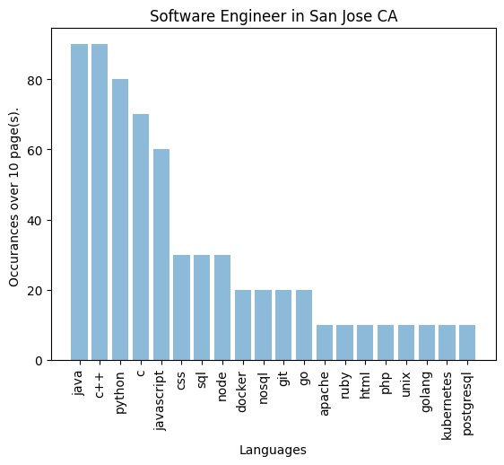

# Job Board Analyzer
A program to search specific keywords on Indeed job postings. \
This uses python3 and selenium to open a headless Firefox browser and scans each job posting looking for keywords specified in languages.txt

## Usage
This program is simple CLI to run.
` python3 boardReader.py [-h] [-v] [-n number] -l=<location> -t=<title> ` \
Example: ``` python3 boardReader.py -t "Software Engineer" -l "San Jose CA" -n 4 ``` will search 4 pages on Indeed.com and examine each job posting. Each job posting will be scanned for the keywords listed in `languages.txt`and a count for each one will be kept. Keywords that do not appear in any job postings will not be included in the results.

Finally, a simple bar graph using matplotlib will be displayed with the results.

Here are the results for 10 pages of Software Engineer job postings in San Jose CA, with the provided lanugages file. 


Here is a quick graphic on the possible arguments.
------------------------------------
Long arg     Short arg    With value  
------------------------------------
--title      -t           yes         
--location   -l           yes         
--number     -n           yes         
--verbose    -v           no          
--help       -h           no          
------------------------------------
